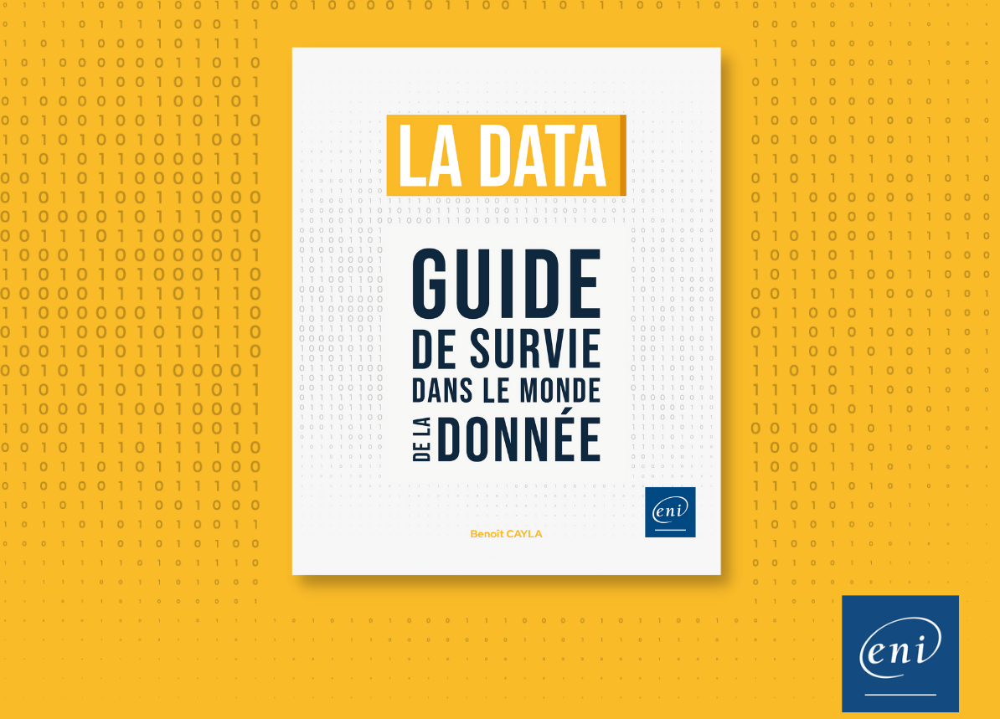

You'll find here the python codes and reference that are used in the book [The Data Handbook](https://datacorner.fr/)  
**Get more and go beyond on my website [datacorner.fr](https://datacorner.fr/)**

# Data Handbook - Chap 1 - Data 360
## Book examples
* [Examples in Python](https://github.com/datacorner/datahandbook/blob/main/Data%20Handbook%20-%20Chap%201%20-%20Data%20360.ipynb) 

# Data Handbook - Chap 4 - Analyzing and cleansing data
## Book examples
* [Examples in Python](https://github.com/datacorner/datahandbook/blob/main/Data%20Handbook%20-%20Chap%204%20-%20Analyzing%20and%20cleansing%20data.ipynb) 

# Data Handbook - Chap 6 - Enhance your data with AI
## Book examples
* [Examples in Python](https://github.com/datacorner/datahandbook/blob/main/Data%20Handbook%20-%20Chap%206%20-%20Enhance%20your%20data%20with%20AI.ipynb) 
